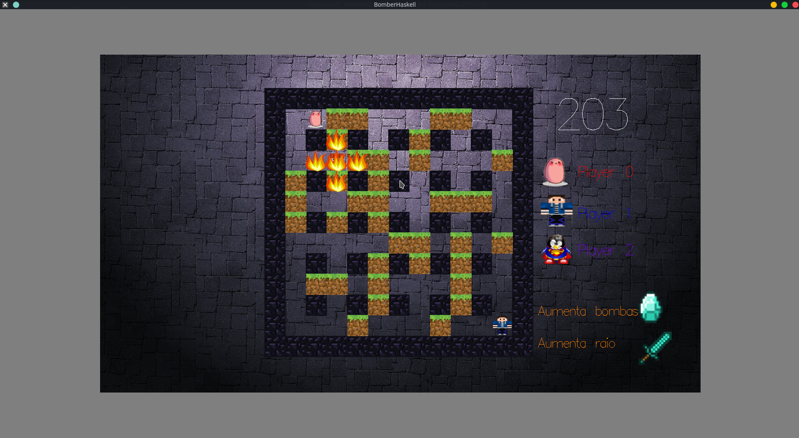

# BomberHaskell



BomberHaskell is a game built with Haskell, mimicking the original 1983 Bomberman. Project made for the 1st year of University.

## Getting Started

### Prerequisites
Clone [this repos](https://github.com/pimonteiro/BomberHaskell) and make sure you have the lastest Haskell version.

Install the following dependencies:
	
 * Gloss
 * Random

by doing so:

```sh
cabal update
cabal install Gloss
cabal install Random
```

### Installing on Unix

Enter source folder and build:

```sh
cd BomberHaskell/src
ghc Tarefa5.hs
```

### Executing

On shell:

```sh
./Tarefa5
```

## Authors

* Filipe Monteiro (me)
* [João Gama Amaral](https://github.com/gamaamaral98)